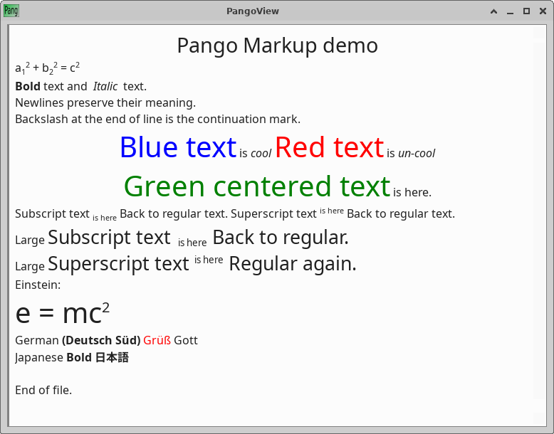

#                                     README
## Document parser and display using pango

  This utility was created to quickly display a formatted file. It was
embarrassing to wait 25 seconds until the browser starts, just to display
a welcome screen.

 The pangview utility displays a .pango file.

 The format of the file is friendly, it is like a fusion of pango, rich
 text and html. (but simpler) The parser was written in python, it is
 easy to extend.

 A quick intro:

     <i> Italic</i>     for italic text
     <b> Bold </b>      for bold text
     <r> Red </r>       for red text
     <xl>Large</xl>     for large text

Line that starts with a double hash is a comment.

## Comment
Text in <hid>hidden</hid> tags are hidden from display.

For a full description of the Syntax see the SYNTAX file.

Note that this text displays nicely both on terminals and on the pangview
utility,

This project is in the public domain.

Peter Glen

# EOF
